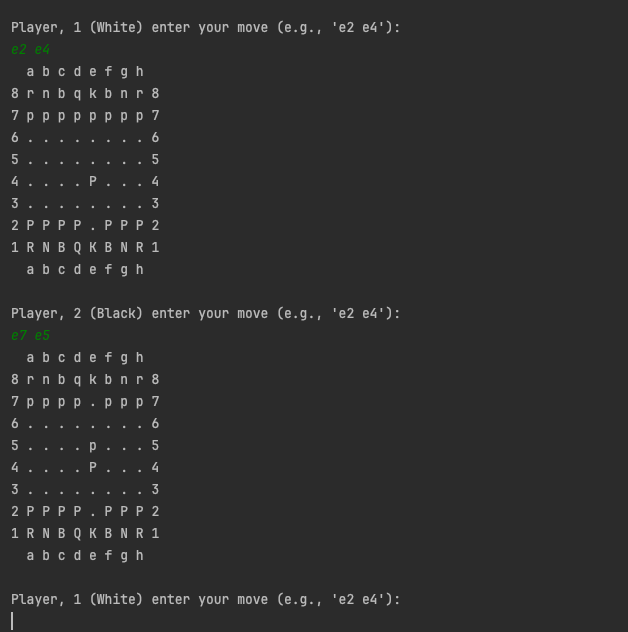
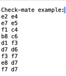
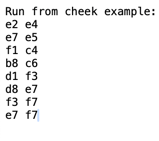
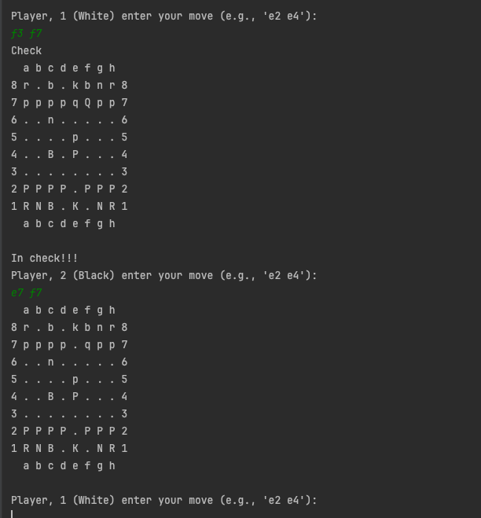

### Chess Game App
- A chess game application written in Scala.

#### Chessboard and chess pieces

- Player 1 is represented by `upper-case` characters, and player 2 by `lower-case` characters. 
  The conventional characters to use here are: Rook(`R`), kNight(`N`), Bishop(`B`), King(`K`), Queen(`Q`), Pawn(`P`). 
  Lower-case characters will be the black and upper-case characters will be the white pieces.
- The chessboard consists of 8 rows, numbered from `1` to `8`, and 8 columns, with the letters `a` to `h`.
- Each player must enter four characters from the console, the first two characters separated by a space from the last two. 
  The first pair of characters represents the starting position of the piece we want to move, and the last two represent the final position where we want to move the piece.
- For example, the characters `e2` and `e4` represent the movement of the `white pawn`, represented by the character `P`, which moves from position `e2` to the new position `e4`.
- If the white player, represented by upper-case characters, moves the piece so that the black king is in immediate danger of attack, the message `check` should appear on the console.
  When the player with black pieces moves after receiving `check`, he will see the message `in check`. The game ends when one of the kings disappears from the chessboard.

                                     

#### Game rules
The move is according to the moves allowed by the piece on the starting position:
- The king can move only 1 square but in any direction;
- The bishop can move any number of squares but only diagonally;
- The rook can move any number of squares but only horizontally or vertically;
- The queen can move any number of squares horizontally, vertically or diagonally;
- The knight can move in an L shape with sides of 2 and 1 squares respectively. That is 8 different possible moves. Unlike other pieces it jumps over other pieces;
- The pawn can move one or two squares forward on its first move (when not taking an opponent piece);
- The pawn can move one square forward on subsequent moves (when not taking an opponent piece);
- The pawn can move one square forward diagonally if taking an opponent piece.

#### Instructions for starting the application
- Go to the "ChessApp" class and press the `Run ChessApp` button, on line 9.

#### Instructions for starting the tests
- To start the tests, type `sbt test` in the terminal;
- Or type `testOnly game.chess.org.board.ChessboardSpec`;
- Or type `testOnly game.chess.org.logic.ChessLogicSpec`.
